<h1>MIMO OFDM  Block Diagram C Modeling and Simulation </h1>	

<table width="600px" border="1" cellpadding="2" cellspacing="2" style="background-color: #ffffff;">
<tr valign="top">
<td style="border-width : 0px;">
 <a href="https://www.ccdsp.org/">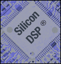</a>

</td>
<td style="border-width : 0px;">
 <!-- width="250" height="297" -->Developed on Linux.

</td>
</tr>
</table>

Icons andCredit the  <a href="https://thenounproject.com/">Noun Project</a>.

<table  width="100%" style="border: 2px solid #000000; border-collapse: collapse" cellspacing="0" cellpadding="0">	
<tr valign="top">
<td width="40" height="15" style="border-width : 0px;">
Item

</td>
<td width="293" height="15" style="border-width : 0px;">
Description 

</td>
<td width="73" height="15" style="border-width : 0px;">
Link

</td>
<td width="134" height="15" style="border-width : 0px;">
Type

</td>
</tr>
<tr valign="top">
<td width="40" style="border-width : 0px;">
1

</td>
<td width="293" style="border-width : 0px;">
Introduction to the Capsim&reg; MIMO OFDM Block Diagram Modeling and Simulation

</td>
<td width="73" style="border-width : 0px;">

</td>
<td width="134" style="border-width : 0px;">
Introduction

</td>
</tr>
<tr valign="top">
  <td style="border-width : 0px;">2</td>
  <td style="border-width : 0px;">
<strong>Computing the  Singular Value Decomposition (SVD) with Fixed Point CORDIC Operations</strong>

    
Application to MIMO-OFDM<strong></strong>
</td>
  <td style="border-width : 0px;"></td>
  <td style="border-width : 0px;">Paper and Latex File</td>
</tr>
<tr valign="top">
<td width="40" style="border-width : 0px;">
3

</td>
<td width="293" style="border-width : 0px;">
 Capsim&reg; Block Diagram MIMO OFDM With Channel Model, Noise and Demodulation of Streams.

</td>
<td width="73" style="border-width : 0px;">

</td>
<td width="134" style="border-width : 0px;">
Screen Shots

</td>
</tr>
<tr valign="top">
  <td style="border-width : 0px;">4</td>
  <td style="border-width : 0px;">Results of Block Diagram Simulations Floating Point (LAPACK) versus Fixed Point CORDIC 2x2 SVD Beam Forming MIMO-OFDM</td>
  <td style="border-width : 0px;"></td>
  <td style="border-width : 0px;">Analysis</td>
</tr>
<tr valign="top">
<td width="40" style="border-width : 0px;">
5

</td>
<td width="293" style="border-width : 0px;">
List of Topologies Included in Repository. See this <a href="#tops_list">link</a> for Block Diagrams for Various Topologies

</td>
<td width="73" style="border-width : 0px;">

</td>
<td width="134" style="border-width : 0px;">
Table

</td>
</tr>
<tr valign="top">
  <td width="40" style="border-width : 0px;">
6

  </td>
  <td width="293" style="border-width : 0px;">
List of OFDM, MIMO and Channel Model  C Blocks Included in Repository

  </td>
  <td width="73" style="border-width : 0px;">

  </td>
  <td width="134" style="border-width : 0px;">
Table

  </td>
</tr>
<tr valign="top">
<td width="40" style="border-width : 0px;">
7

</td>
<td width="293" style="border-width : 0px;">
List of MIMO and Channel Model  C Subroutines Included in Repository

</td>
<td width="73" style="border-width : 0px;">

</td>
<td width="134" style="border-width : 0px;">
Table

</td>
</tr>
<tr valign="top">
<td width="40" style="border-width : 0px;">
8

</td>
<td width="293" style="border-width : 0px;">
Building Capsim&reg; for MIMO OFDM Modeling and Simulation 

</td>
<td width="73" style="border-width : 0px;">

</td>
<td width="134" style="border-width : 0px;">
Instructions

</td>
</tr>
<tr valign="top">
<td width="40" style="border-width : 0px;">
9

</td>
<td width="293" style="border-width : 0px;">
Capsim&reg; Text Mode Kernel (TMK) Installation 

</td>
<td width="73" style="border-width : 0px;">

</td>
<td width="134" style="border-width : 0px;">
GitHub Repository

</td>
</tr>
<tr valign="top">
<td width="40" style="border-width : 0px;">
10

</td>
<td width="293" style="border-width : 0px;">
GitHub Repository Capsim&reg; MIMO OFDM Block Diagram Modeling and Simulation

</td>
<td width="73" style="border-width : 0px;">

</td>
<td width="134" style="border-width : 0px;">
GitHub Repository

</td>
</tr>
<tr valign="top">
<td width="40" style="border-width : 0px;">
11

</td>
<td width="293" style="border-width : 0px;">
GitHub Repository Capsim&reg;  OFDM Block Diagram Modeling and Simulation

</td>
<td width="73" style="border-width : 0px;">

</td>
<td width="134" style="border-width : 0px;">
GitHub Repository

</td>
</tr>		
<tr valign="top">
<td width="40" style="border-width : 0px;">
12

</td>
<td width="293" style="border-width : 0px;">
OFDM Video Tutorials by Silicon DSP Corporation

</td>
<td width="73" style="border-width : 0px;">

</td>
<td width="134" style="border-width : 0px;">
Video Tutorial

</td>
</tr>
<tr valign="top">
<td width="40" style="border-width : 0px;">13 
</td>
<td width="293" style="border-width : 0px;">MIMO OFDM  Video Tutorials by Silicon DSP Corporation 
</td>
<td width="73" style="border-width : 0px;"> 
</td>
<td width="134" style="border-width : 0px;">Video Tutorial 
</td>
</tr>
		
<tr valign="top">
<td width="40" style="border-width : 0px;">14 
</td>
<td width="293" style="border-width : 0px;">Video Capsim Block Diagram Modeling MIMO-OFDM Open Loop 2x2 and 2x3 (must view for insights and better understanding of this Repository) 
</td>
<td width="73" style="border-width : 0px;"> 
</td>
<td width="134" style="border-width : 0px;">Video Tutorial 
</td>
</tr>
<tr valign="top">
<td width="40" style="border-width : 0px;"> 
</td>
<td width="293" style="border-width : 0px;"> 
</td>
<td width="73" style="border-width : 0px;"> 
</td>
<td width="134" style="border-width : 0px;"> 
</td>
</tr>
</table>

Note many blocks and subroutiunes used are described in the ofdm repository.

<pre>Copyright (c) 1993-2007 Silicon DSP Corporation
Permission is granted to copy, distribute and/or modify this
document under the terms of the GNU Free Documentation License,
Version 1.2 or any later version published by the Free Software
Foundation; with no Invariant Sections, no Front-Cover Texts, and
no Back-Cover Texts. A copy of the license is included in the
section entitled "GNU Free Documentation License". </pre>
 

<h2>Introduction</h2>

Silicon DSP Corporation has developed all the C code for a full implementation of a multiple MIMO OFDM Block Diagram Modeling and Simulation Systems  for both Open Loop and Closed Loop MIMO OFDM systems.
The modular architecture uses individual blocks (written in C)  for the implementation of the various stages in modulation and demodulation.
Subroutines ( C code) are also supplied with Include files shared between blocks and subroutines.
See the Block Diagram of a full system <a href="#mimo-ofdm">here</a>.

The majority of blocks were written in 2006-2007 with major enhancements throughout the years.

In addition, the Capsim&reg; MIMO OFDM Block Diagram system was extensively used in developing the  tutorials on MIMO OFDM.

Click  <a href="https://www.youtube.com/playlist?list=PLqL72R3p_ZYLChzqSDrQGYKl_qvCaFW3U">here</a> for the MIMO OFDM Tutorial Videos on . <!--width="300" height="67" -->
 

For the development of the fixed point CORDIC Beam Forming MIMO-OFDM the methodology used by Nariankadu D. Hemkumar was used. See the reference below.

&nbsp;&nbsp;&nbsp;&nbsp;&nbsp;&nbsp;Nariankadu D. Hemkumar, <strong>Efficient VLSI Architectures for Matrix Factorization,</strong> Ph.D. Dissertation, Rice University, April 1994.

The primary author of the Open-Loop and Closed Loop floating point and fixed point MIMO work was Dr. Sasan Ardalan at Silicon DSP Corporation.  See the OFDM repository at for credits on the OFDM blocks and subroutines.

We highly recommend the following paper for the analysis of the performance of MIMO-OFDM systems:

&nbsp;&nbsp;&nbsp;&nbsp;&nbsp;Jie Gao, O. C. Ozdural, S. H. Ardalan and Huaping Liu, &quot;<strong>Performance modeling of MIMO OFDM systems via channel analysis</strong>,&quot; in <em>IEEE Transactions on Wireless Communications,</em> vol. 5, no. 9, pp. 2358-2362, September 2006

Also see the results of block diagram simulations floating point (LAPACK) versus fixed point CORDIC 2x2 SVD Beam Forming MIMO-OFDM <a href="#results-fxp-floating-point">here</a> in this page.

Note that blocks are also provided where instead of fixed point CORDIC, the trigonomic functions are computed in floating point. The blocks help validate the fixed point algorithms.

<strong>Note:</strong> this repository supports the Text Mode Kernel version of Capsim&reg;. 
  The graphical block diagram is from the soon to be released Capsim&reg; Version 7 which uses  Qt&reg; for interactive graphical interface. 
  However, the topology in this Repository are the same. You can use the block names in the screen shot and then use the
  Capsim&reg; command  "to blockname" to go the the block, change parameters and run the simulation.
  There is a lot of benefit to the non graphical mode in portability and flexibility.
  The graphical version also supports the text mode operation.

An updated link to   Capsim&reg; Version 7  using Qt&reg; will be provided in the Repostory on GitHub. Stay tuned.
<h2 style="margin-left:1em;">Table MIMO OFDM Configurations</h2>
<table style="border: 2px solid #000000; border-collapse: collapse" cellspacing="0" cellpadding="0"  width="734">
  <tr>
    <td width="109" valign="top">
<strong>Configuration</strong>
</td>
    <td width="40" valign="top">
<strong>Tx</strong>
</td>
    <td width="42" valign="top">
<strong>Rx</strong>
</td>
    <td width="75" valign="top">
<strong>CSI</strong> 
</td>
    <td width="67" valign="top">
<strong>FFTs</strong>
</td>
    <td width="55" valign="top">
<strong>SVD</strong>
</td>
    <td width="48" valign="top">
<strong>QR</strong>
</td>
    <td width="59" valign="top">
<strong>Rate</strong>
</td>
    <td width="219" valign="top">
<strong>Application</strong>
</td>
  </tr>
  <tr>
    <td width="109" valign="top">
1x1 SISO
</td>
    <td width="40" valign="top">
1
</td>
    <td width="42" valign="top">
1
</td>
    <td width="75" valign="top">
No 
</td>
    <td width="67" valign="top">
1
</td>
    <td width="55" valign="top">
No
</td>
    <td width="48" valign="top">
No
</td>
    <td width="59" valign="top">
1x
</td>
    <td width="219" valign="top">
Lowest Data Rate, Lowest Power
</td>
  </tr>
  <tr>
    <td width="109" valign="top">
1x2 MRC
</td>
    <td width="40" valign="top">
1
</td>
    <td width="42" valign="top">
2
</td>
    <td width="75" valign="top">
No
</td>
    <td width="67" valign="top">
2
</td>
    <td width="55" valign="top">
No
</td>
    <td width="48" valign="top">
No
</td>
    <td width="59" valign="top">
1x
</td>
    <td width="219" valign="top">
Reliable Low Rate. Longer range more power.
</td>
  </tr>
  <tr>
    <td width="109" valign="top">
2x2 Open Loop
</td>
    <td width="40" valign="top">
2
</td>
    <td width="42" valign="top">
2
</td>
    <td width="75" valign="top">
No
</td>
    <td width="67" valign="top">
2
</td>
    <td width="55" valign="top">
2x2
</td>
    <td width="48" valign="top">
No
</td>
    <td width="59" valign="top">
2x
</td>
    <td width="219" valign="top">
Medium Data Rate
</td>
  </tr>
  <tr>
    <td width="109" valign="top">
2x2 Beam Forming
</td>
    <td width="40" valign="top">
2
</td>
    <td width="42" valign="top">
2
</td>
    <td width="75" valign="top">
Yes
</td>
    <td width="67" valign="top">
2
</td>
    <td width="55" valign="top">
2x2
</td>
    <td width="48" valign="top">
No
</td>
    <td width="59" valign="top">
2x
</td>
    <td width="219" valign="top">
Medium Date Rate more reliable then Open Loop
</td>
  </tr>
  <tr>
    <td width="109" valign="top">
2x3 Open Loop
</td>
    <td width="40" valign="top">
2
</td>
    <td width="42" valign="top">
3
</td>
    <td width="75" valign="top">
No
</td>
    <td width="67" valign="top">
3
</td>
    <td width="55" valign="top">
2x2
</td>
    <td width="48" valign="top">
Yes
</td>
    <td width="59" valign="top">
2x
</td>
    <td width="219" valign="top">
Reliable Medium Data Rate
</td>
  </tr>
  <tr>
    <td width="109" valign="top">
4x2 Beam Forming
</td>
    <td width="40" valign="top">
4
</td>
    <td width="42" valign="top">
2
</td>
    <td width="75" valign="top">
Yes
</td>
    <td width="67" valign="top">
2
</td>
    <td width="55" valign="top">
2x2
</td>
    <td width="48" valign="top">
No
</td>
    <td width="59" valign="top">
2x
</td>
    <td width="219" valign="top">
High Down link Data Rate, Reliable Up-link, Low Power Video 
</td>
  </tr>
  <tr>
    <td width="109" valign="top">
3x4 Open Loop
</td>
    <td width="40" valign="top">
3
</td>
    <td width="42" valign="top">
4
</td>
    <td width="75" valign="top">
No
</td>
    <td width="67" valign="top">
4
</td>
    <td width="55" valign="top">
3x3
</td>
    <td width="48" valign="top">
Yes
</td>
    <td width="59" valign="top">
3x
</td>
    <td width="219" valign="top">
High Data Rate
</td>
  </tr>
  <tr>
    <td width="109" valign="top">
4x4 Beam Forming
</td>
    <td width="40" valign="top">
4
</td>
    <td width="42" valign="top">
4
</td>
    <td width="75" valign="top">
Yes
</td>
    <td width="67" valign="top">
4
</td>
    <td width="55" valign="top">
4x4
</td>
    <td width="48" valign="top">
No
</td>
    <td width="59" valign="top">
4x
</td>
    <td width="219" valign="top">
Very High Data Rate
</td>
  </tr>
  <tr>
    <td width="109" valign="top">
1x4 Beam Forming
</td>
    <td width="40" valign="top">
1
</td>
    <td width="42" valign="top">
4
</td>
    <td width="75" valign="top">
Yes
</td>
    <td width="67" valign="top">
4
</td>
    <td width="55" valign="top">
4x4
</td>
    <td width="48" valign="top">
No
</td>
    <td width="59" valign="top">
1x
</td>
    <td width="219" valign="top">
Very Long  Range
</td>
  </tr>
</table>

   
	 

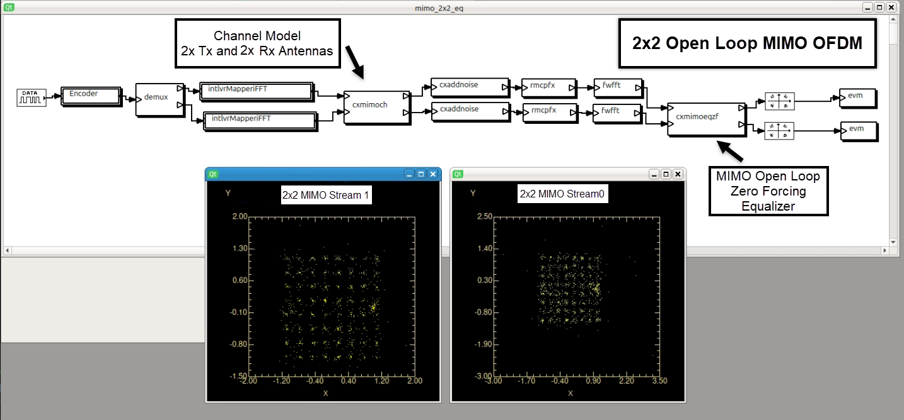

<h2>Capsim® MIMO OFDM 2x2 Open Loop with Channel Modeling and Noise Specification</h2>

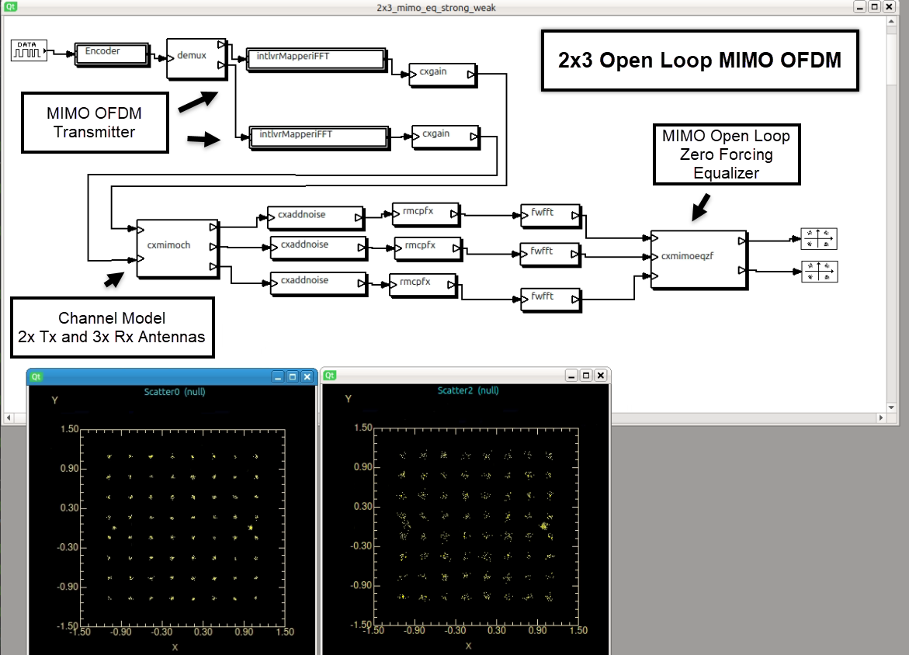

<h2>Capsim&reg; MIMO OFDM 3x2 Open Loop with Channel Modeling and Noise Specificaton</h2>

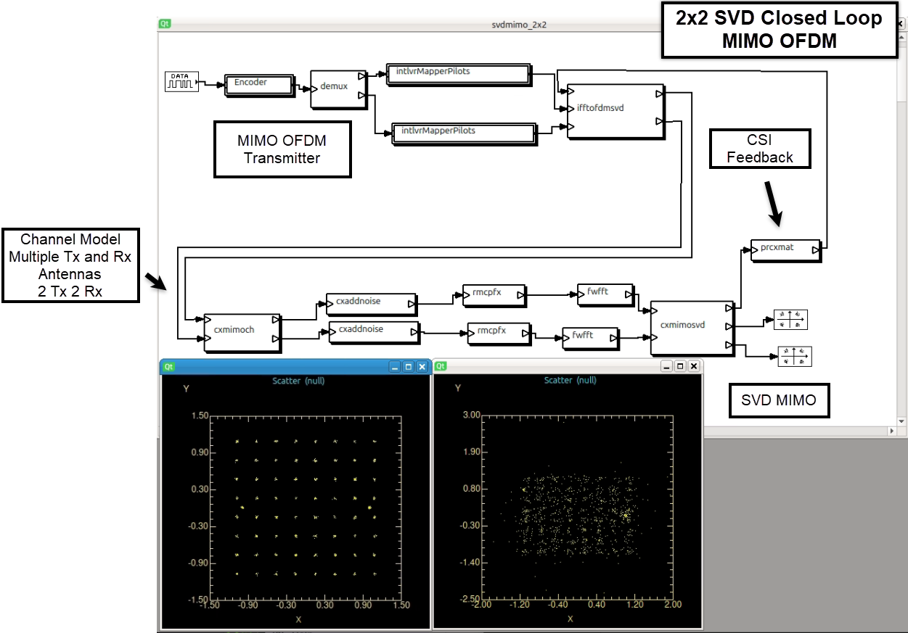

<h2>Capsim&reg; Closed Loop SVD MIMO OFDM 2x2  with CSI Feedback Channel Modeling and Noise Specificaton</h2>

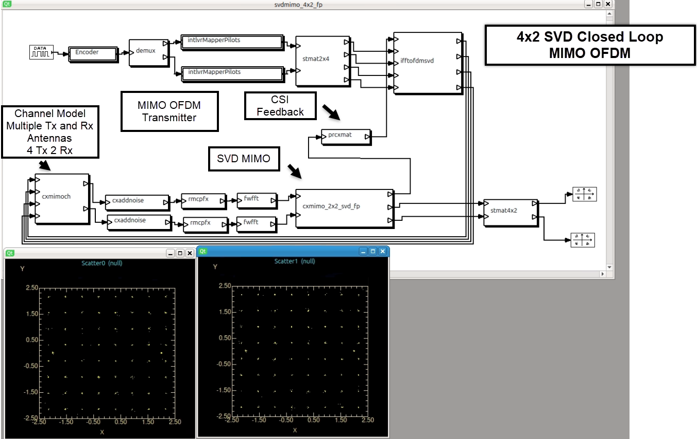

<h2>Capsim&reg; Closed Loop SVD MIMO OFDM 4x2  with CSI Feedback Channel Modeling and Noise Specificaton</h2>

 
  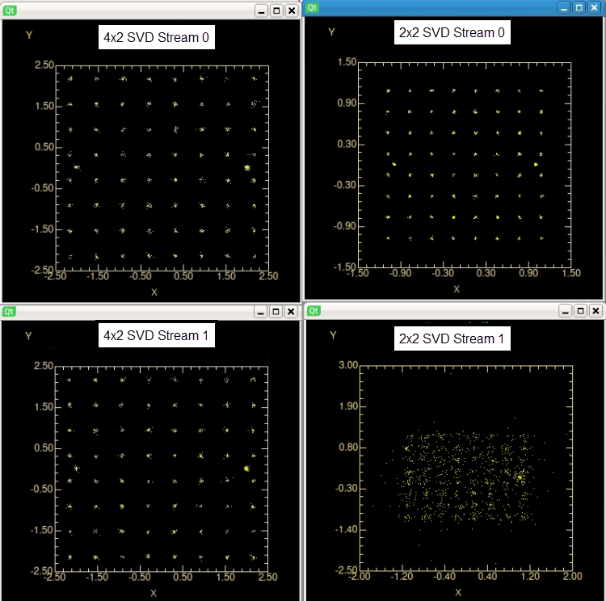

<h2>Comparison of Received Streams 4x2 SVD MIMO OFDM versus 2x2 SVD MIMO OFDM (Channel 50ns Delay Spread) </h2>

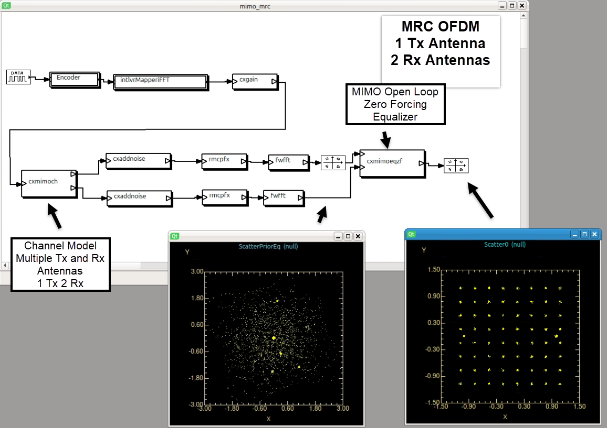

<h2>Maximum Ratio Combining (MRC)   OFDM (Channel 50ns Delay Spread)</h2>

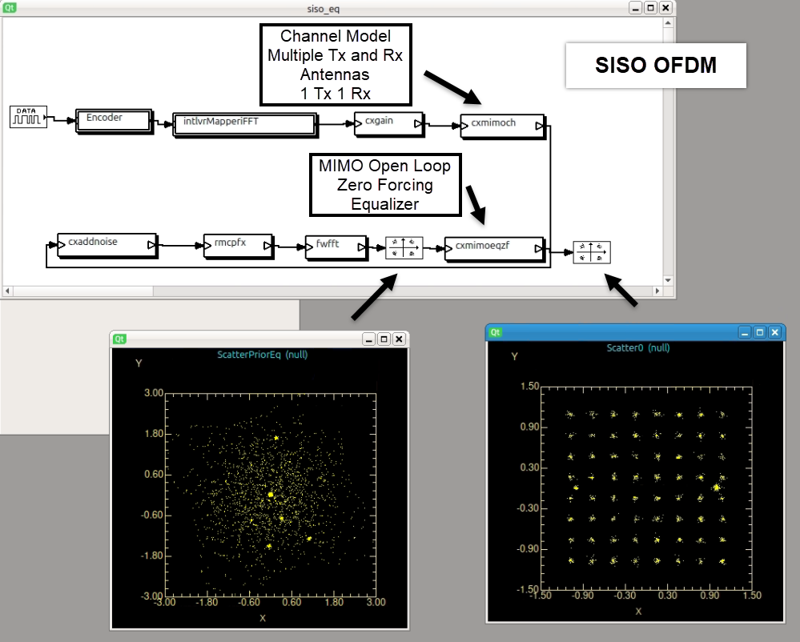 
  

<h2>SISO (Single Input Single Output)    OFDM (Channel 50ns Delay Spread)</h2>

	
<h1>Results of Block Diagram Simulations Floating Point (LAPACK) versus Fixed Point CORDIC 2x2 SVD Beam Forming MIMO-OFDM</h1>
<h2>Floating Point versus Fixed Point 2x2 Closed Loop MIMO OFDM High SNR</h2>

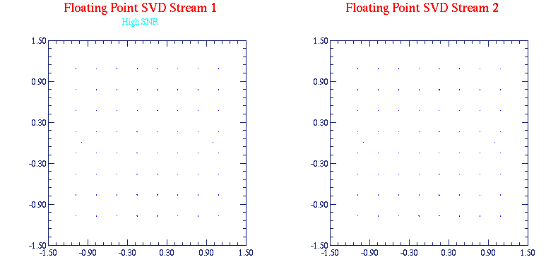

<h3>LAPACK Floating Point Library, 2x2 Beam Forming MIMO OFDM 64 QAM Constellations for Each Stream High SNR</h3>

&nbsp;

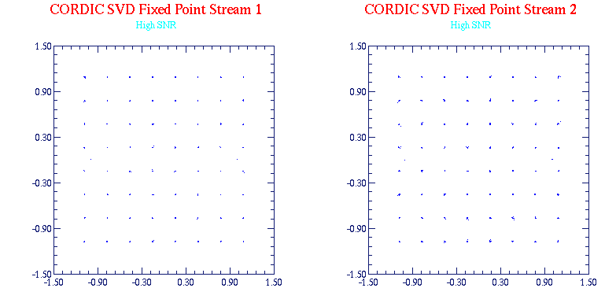

<h3>CORDIC Fixed Point  2x2 SVD 2x2 Beam Forming MIMO OFDM 64 QAM Constellations for Each Stream  , High SNR</h3>
<h2>Floating Point versus Fixed Point 2x2 Closed Loop MIMO OFDM Medium SNR</h2>
 
A key comparison is the case where channel noise is added. In this case, we expect that the finite precision fixed point CORDIC SVD will enhance noise and degrade performance compared to the floating point LAPACK implementation. This is shown in the fFigures below where noise variance of 1e-5 was added to each receive chain. 
<h1>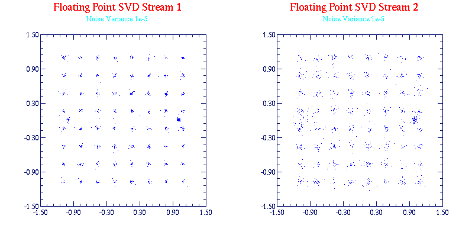</h1>
<h3>2x2 Beam Forming MIMO OFDM 64 QAM Constellations for Each Stream LAPACK Floating Point Library, Medium SNR</h3>
<h1>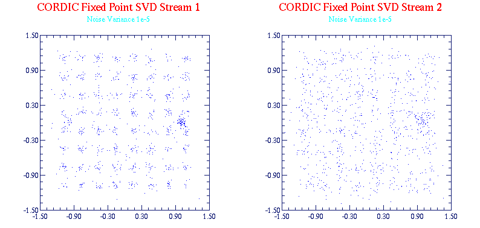</h1>
<h3>2x2 Beam Forming MIMO OFDM 64 QAM Constellations for Each Stream CORDIC Fixed Point  2x2 SVD , Medium SNR</h3>
	
<h2>More Results on Comparing Floating Point LAPACK versus Fixed Point CORDIC 2x2 SVD</h2>	

To show that the fixed point CORDIC 2x2 SVD tracks the floating point SVD in a 2x2 MIMO OFDM system we show the plot of the ratio of Singular Values for various carriers (52 for IEEE 802.11a streams) in the  Figure below  with additive noise(variance 1e-5). Note that the ratios track very well over the 52 carriers. The deviation is at the high Singular Value Ratio which corresponds to an ill conditioned channel at that carrier frequency. The enhancement of  roundoff noise is caused at this point and other ill conditioned channel conditions. 	

	
  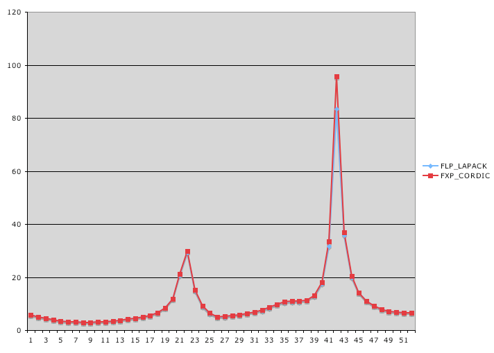
<h3>Singular Value Ratio: Floating Point versus Fixed Point 2x2 Closed Loop For Each Carrier(52)</h3>		

<h1>List of Topologies (Block Diagrams and Hierarchical Blocks and TCL Scripts)</h1>
    <table style="border: 2px solid #000000; border-collapse: collapse" cellspacing="0" cellpadding="0" >
        <tr><th>Item</th><th>Topology Name</th><th>Description</th><th>Author</th><th>Date</th></tr>
        <tr>
            <td>1</td>
            <td> mimo_2x2_eq.t</td>
            <td>MIMO OFDM Open Loop 2 Tx and 2 Rx Antennas</td>
            <td>Ardalan</td>
            <td>2007</td>
        </tr>
        <tr>
            <td>2</td>
            <td>mimo_2x3_eq_equal.t </td>
            <td>MIMO OFDM Open Loop 2 Tx and 3 Rx Antennas</td>
            <td>Ardalan</td>
            <td>2007</td>
        </tr>
        <tr>
            <td>3</td>
            <td>2x3_mimo_eq_strong_weak.t</td>
            <td>MIMO OFDM Open Loop 2 Tx and 3 Rx Antennas one strong stream and one weak stream due to channel.</td>
            <td>Ardalan</td>
            <td>2007</td>
        </tr>
        <tr>
            <td>4</td>
            <td>svdmimo_2x2.t</td>
            <td>SVD Closed Loop MIMO OFDM 2 Tx and 2 Rx Antennas</td>
            <td>Ardalan</td>
            <td>2007</td>
        </tr>
        <tr>
            <td>5</td>
            <td>svdmimo_4x2.t</td>
            <td>SVD Closed Loop MIMO OFDM 4 Tx and 2 Rx Antennas</td>
            <td>Ardalan</td>
            <td>2007</td>
        </tr>
        <tr>
            <td>6</td>
            <td>intlvrMapperiFFT.t</td>
            <td>Hierarchical Block (HBlock) Interleaver 64 QAM Mapper Pilot Insertion Inverse FFT <a href="#interleaverMapper">Block Diagram Link</a></td>
            <td>Ardalan</td>
            <td>2002</td>
        </tr>
        <tr>
            <td>7</td>
            <td>svdmimo_4x2_float_wk.t</td>
            <td>SVD Closed Loop MIMO OFDM 4 Tx and 2 Rx Antennas CORDIC Floating Point</td>
            <td>Ardalan</td>
            <td>2007</td>
        </tr>
        <tr>
            <td>8</td>
            <td>svdmimo_4x2_fxp_wk.t</td>
            <td>SVD Closed Loop MIMO OFDM 4 Tx and 2 Rx Antennas CORDIC Fixed Point (32/16 bit)</td>
            <td>Ardalan</td>
            <td>2007</td>
        </tr>
        <tr>
            <td>9</td>
            <td> svd_fxp_2x2_mimo.t</td>
            <td>SVD Closed Loop MIMO OFDM 2 Tx and 2 Rx Antennas CORDIC Fixed Point (32/16 bit)</td>
            <td>Ardalan</td>
            <td>2007</td>
        </tr>
        <tr>
            <td>10</td>
            <td>svd_fp_2x2_mimo.t</td>
            <td>SVD Closed Loop MIMO OFDM 4 Tx and 2 Rx Antennas CORDIC Floating Point</td>
            <td>Ardalan</td>
            <td>2007</td>
        </tr>
        <tr>
            <td>11</td>
            <td>siso_eq.t</td>
            <td>Single Input Single Output (SISO) OFDM </td>
            <td>Ardalan</td>
            <td>2007</td>
        </tr>
        <tr>
            <td>12</td>
            <td>mimo_mrc.t</td>
            <td>Maximum Ratio Combining (MRC) 2 Tx and 1 Rx Antennas</td>
            <td>Ardalan</td>
            <td>2007</td>
        </tr>
        <tr>
            <td>13</td>
            <td>Encoder.t</td>
            <td>Data Field/Scramble/Convolutional Encoder/Puncture HBlock <a href="#Encoder">Block Diagram Link</a></td>
            <td>Ardalan</td>
            <td>2002</td>
        </tr>
        <tr>
            <td>14</td>
            <td>&nbsp; </td>
            <td>&nbsp;</td>
            <td>&nbsp;</td>
            <td>&nbsp;</td>
        </tr>
        <tr>
            <td>18</td>
            <td>&nbsp;</td>
            <td>&nbsp;</td>
            <td>&nbsp;</td>
            <td>&nbsp;</td>
        </tr>
    </table>

<h1>List of Blocks</h1>
   <table style="border: 2px solid #000000; border-collapse: collapse" cellspacing="0" cellpadding="0"  >
        <tr><th width="59">Item</th><th width="166">Block Name</th><th width="307">Description</th><th width="62">Author</th><th width="154">Date</th></tr>
        <tr>
            <td>1</td>
            <td>cxmimoeqzf.s</td>
            <td>Open Loop MIMO Equalizer  Automatically adjust number of channels of  Tx and Rx antennas (Streams)</td>
            <td>Ardalan</td>
            <td>2007</td>
        </tr>
        <tr>
            <td>2</td>
            <td>cxmimosvd.s</td>
            <td>Closed Loop SVD MIMO  with LAPACK </td>
            <td>Ardalan</td>
            <td>2007</td>
        </tr>
        <tr>
            <td>3</td>
            <td>cxmimo_2x2_svd.s</td>
            <td>Closed Loop SVD MIMO  CORDIC Fixed Point </td>
            <td>Ardalan</td>
            <td>2007</td>
        </tr>
        <tr>
            <td>4</td>
            <td>cxmimo_2x2_svd_fp.c</td>
            <td>Closed Loop SVD MIMO  CORDIC Floating Point</td>
            <td>Ardalan</td>
            <td>2007</td>
        </tr>
        <tr>
            <td>5</td>
            <td>ifftofdm54.s</td>
            <td>inverse FFT 54 Mbps </td>
            <td>Ardalan</td>
            <td>2002</td>
        </tr>
        <tr>
            <td>6</td>
            <td>ifftofdmsvd.s</td>
            <td>inverse FFT 54 Mbps SVD with CSI Support</td>
            <td>Ardalan</td>
            <td>2002/2007</td>
        </tr>
        <tr>
            <td>7</td>
            <td>prcxmat.s</td>
            <td>Print the complex matrix samples. </td>
            <td>Ardalan</td>
            <td>2007</td>
        </tr>
        <tr>
            <td>8</td>
            <td>cxequalizezf..s</td>
            <td>OFDM Frequency Equalizer</td>
            <td>Ardalan</td>
            <td>2007</td>
        </tr>
        <tr>
            <td>9</td>
            <td>cxmimoch.s</td>
            <td>MIMO Channel Auto Fan-In and Fan-Out Automatically adjust number of channels per connections for Tx Antennas and Rx antennas.</td>
            <td>Ardalan</td>
            <td>2007</td>
        </tr>
        <tr>
            <td>10</td>
            <td>rmcpfx.s</td>
            <td>Remove Cyclic Prefix </td>
            <td>Ardalan</td>
            <td>2002</td>
        </tr>
        <tr>
            <td>11</td>
            <td>evm.s</td>
            <td>Calculate EVM with specifie ideal QAM Map (qam64.dat)</td>
            <td>Ardalan</td>
            <td>2006</td>
        </tr>
        <tr>
            <td>12</td>
            <td>stmat2x4.c </td>
            <td>Convert two streams to 4 streams using orthogonal steering matrix</td>
            <td>Ardalan</td>
            <td>2007</td>
        </tr>
        <tr>
            <td>13</td>
            <td>stmat4x2.c </td>
            <td>Convert Four streams to two streams based on transpose of 2x4  using orthogonal steering matrix </td>
            <td>Ardalan</td>
            <td>2007</td>
        </tr>
        <tr>
            <td>14</td>
            <td>fwfft.s</td>
            <td>Forward FFT</td>
            <td>&nbsp;</td>
            <td>&nbsp;</td>
        </tr>
        <tr>
            <td>15</td>
            <td>&nbsp; </td>
            <td>&nbsp; </td>
            <td></td>
            <td></td>
        </tr>
    </table>
 

    <h1>Table of Subroutines</h1>
    <table style="border: 2px solid #000000; border-collapse: collapse" cellspacing="0" cellpadding="0">
        <tr><th>Item</th><th>Block Name</th><th>Description</th><th>Author</th><th>Date</th></tr>
        <tr>
            <td>1</td>
            <td>Krn_Compute2x2SVDCxMatrix.c </td>
            <td>Compute SVD 2x2 Complex Matrix CORDIC Fixed Point</td>
            <td>Adalan</td>
            <td>2007</td>
        </tr>
        <tr>
            <td>2</td>
            <td>Krn_Compute2x2SVDCxMatrixFP.c </td>
            <td>Compute SVD 2x2 Complex Matrix CORDIC Floating Point</td>
            <td>Adalang</td>
            <td>2007</td>
        </tr>
        <tr>
            <td>3</td>
            <td>CordicRotate.c </td>
            <td>Fixed Point CORDIC Rotate</td>
            <td>R.Maslennikov, A.Khoryaev</td>
            <td>2003</td>
        </tr>
        <tr>
            <td>4</td>
            <td>CordicArctan.c</td>
            <td>Fixed Point CORDIC Arc Tangent.</td>
            <td>R.Maslennikov, A.Khoryaev</td>
            <td>2003</td>
        </tr>
        <tr>
            <td>5</td>
            <td>krn_dsp.c</td>
            <td>Complex Matrix Operations and Printing</td>
            <td>Ardalan</td>
            <td>2007</td>
        </tr>
        <tr>
            <td>6</td>
            <td>krn_lapack.c</td>
            <td>API for Lapack (via CLAPACK) for Eigenvaluue/SVD/Inverse, Complex and Real.</td>
            <td>Ardalan</td>
            <td>2007</td>
        </tr>
        <tr>
            <td>7</td>
            <td>MatrixUtils.c</td>
            <td>Matrix Operations Utilities Fixed Point</td>
            <td>Ardalan</td>
            <td>2007</td>
        </tr>
        <tr>
            <td>8</td>
            <td>&nbsp;</td>
            <td>&nbsp;</td>
            <td>&nbsp;</td>
            <td>&nbsp;</td>
        </tr>
    </table>
      
     

<h1>    Instructions for Running Capsim&reg; MIMO-OFDM Block Diagram Simulation.</h1>
  
<strong>1-</strong> Obtain the Capsim&reg; Text Mode Kernel (CapsimTMK) for Linux  from:

<a href="https://github.com/silicondsp/capsim-tmk">GitHub Capsim Text Mode  Repository </a>

CapsimTMK is  distributed with hundreds of  blocks. To simulate OFDM systems the blocks in this repository have to be incorporated into Capsim&reg; including subroutines.

 This Repository contains the Topologies for MIMO OFDM block diagram modeling inlcuding required  blocks and subroutines.

Note: Follow the <b>Getting Started Guidelines</b> in the CapsimTMK Repository.

<strong>2- </strong>Once CapsimTMK is installed just run 'make' in this repository's  Build directory.

<strong>3- </strong>Then change to the directory 'Topologies' and run:

<strong></strong>../Build/capsim mimo_2x3_eq_equal.t 
 </strong>
  
The block diagram for the<strong> mimo_2x3_eq_equal.t </strong>topology is shown <a href="#mimo-ofdm">here</a>.
 
Two files will be created:
 
 
 <pre>
 Welcome to Capsim Text Mode Kernel (CapsimTMK)
(c)1989-2017 Silicon DSP Corporation
This is free software; see the source for copying conditions. There is NO
warranty; not even for MERCHANTABILITY or FITNESS FOR A PARTICULAR PURPOSE.
http://www.silicondsp.com
Version 6.2
Running topology  mimo_2x3_eq_equal.t 
model name:  mimo_2x3_eq_equal
...
scatter created file: Scatter0.sct 
scatter created file: Scatter2.sct 
</pre> 
  

The two scatter plots showing the 64 QAM constellations can be plotted using the command:	 

 <strong>source xscatter</strong>

 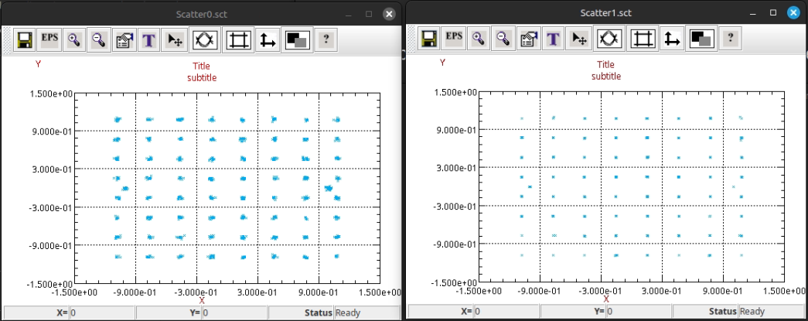
  

 The xscatter file is:

 <strong>java -jar /home/research/SDSP_Github/capsim-tmk/TOOLS/IIPPlot.jar -scatter Scatter0.sct -scatter Scatter1.sct </strong> 	
The Java program <strong>IIPPlot.jar</strong> is provided with the CapsimTMK repository. Note the nice capability to plot multiple files..

For IIPlot Information and Download click <a href="https://www.ccdsp.org/IIPPlot/index.html">here</a>.

 With Linux you can send the plot application to run in the background to put plots side by side when you want to display multiple plots. Then bring them to the forgound and use Control C to exit.
<h2 style="margin-left:1em;">Hierarchical Blocks</h2>
	

<h3 style="margin-left:1em;">Encoder.t 
  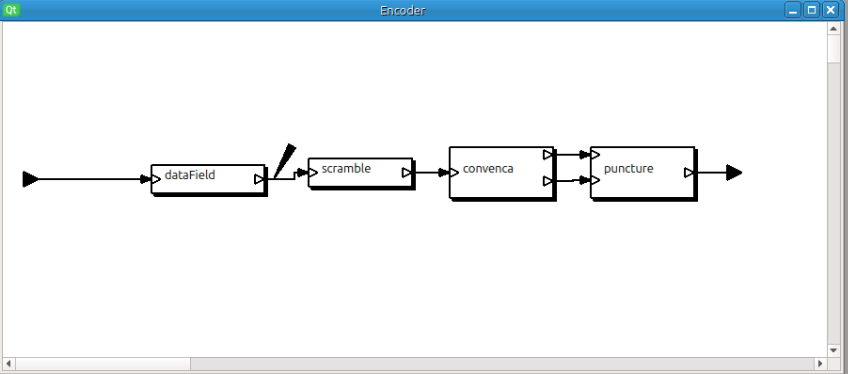</h3>
	

<h3 style="margin-left:1em;">Hierarchical Block (HBlock) Interleaver 64 QAM Mapper Inverse FFT</h3>

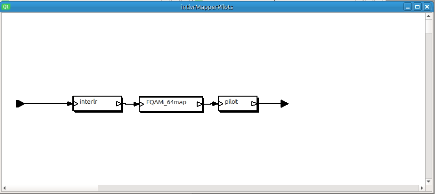

 

<strong>Linux Tux </strong>By <a rel="nofollow" class="external text" href="http://www.isc.tamu.edu/~lewing/">Larry Ewing</a>, <a rel="nofollow" class="external text" href="http://www.home.unix-ag.org/simon/">Simon Budig</a>, <a rel="nofollow" class="external text" href="https://github.com/garrett/Tux">Garrett LeSage</a> - <a rel="nofollow" class="external free" href="https://isc.tamu.edu/~lewing/linux/">https://isc.tamu.edu/~lewing/linux/</a>, <a rel="nofollow" class="external free" href="http://www.home.unix-ag.org/simon/penguin/">http://www.home.unix-ag.org/simon/penguin/</a>, <a rel="nofollow" class="external text" href="https://github.com/garrett/Tux">garrett/Tux</a> on GitHub, <a href="http://creativecommons.org/publicdomain/zero/1.0/deed.en" title="Creative Commons Zero, Public Domain Dedication">CC0</a>, <a href="https://commons.wikimedia.org/w/index.php?curid=753970">Link</a>
  

&nbsp;

 
  
Capsim® uses LAPACK via CLAPACK.

Anderson, E. and Bai, Z. and Bischof, C. and Blackford, S. and Demmel, J. and Dongarra, J. and Du Croz, J. and Greenbaum, A. and Hammarling, S. and McKenney, A. and Sorensen, D., <strong>LAPACK Users' Guide,</strong>Third Edition,Society for Industrial and Applied Mathematics, Philadelphia, PA, ISBN = 0-89871-447-8, 1999	

   
  
  

<strong>Silicon DSP Corporation</strong>

2002-2025

https://www.ccdsp.org

